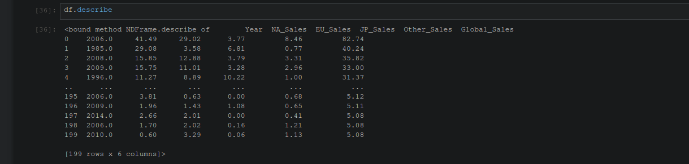
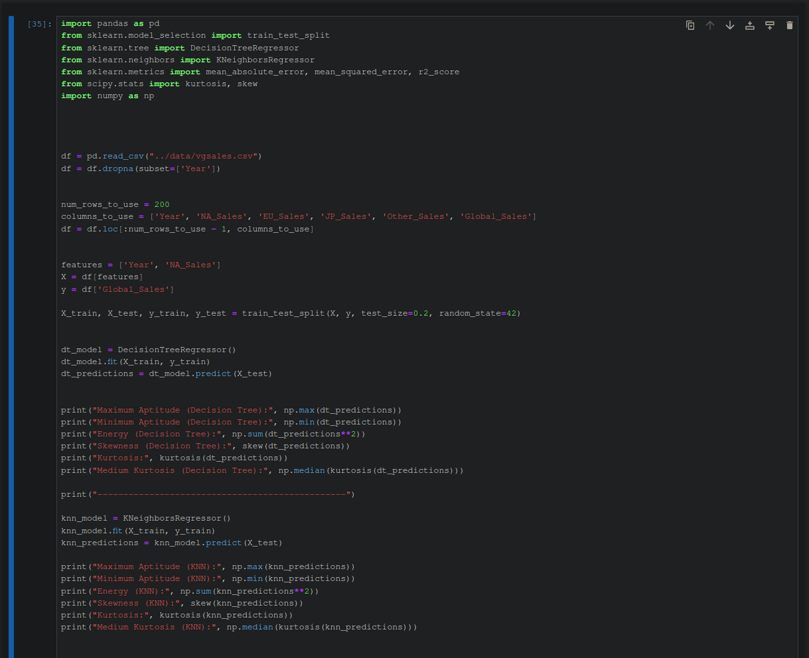
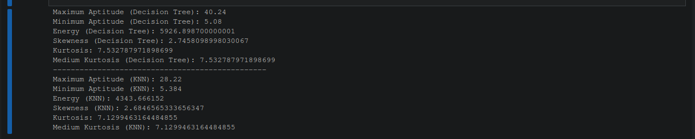

# machine-learning-assignment


project-structure
```
.
├── data
│   └── vgsales.csv
├── LICENSE
├── README.md
├── requirment.txt
├── script
│   ├── run.ipynb
│   └── run.py
└── src
    ├── data_describe.png
    ├── main_code.png
    ├── other_matrics.png
    └── output.png

4 directories, 6 files

```

## Instructions for Running the Project
note: If you are a windows user, run this on powershell
you can open it by hiting win+r & typeing "powershell" enter


#### 1. Clone the Repository
```
git clone https://github.com/Himanshu-Parangat/machine-learning-assignment
cd machine-learning-assignment/
```

#### 2. Create Virtual Environment & activate
```
python -m venv .env
.\.env\Scripts\activate
```

#### 3. install all packages
```
pip install -r requirements.txt
```

#### 4. run the project

> * for runing in terminal 
```
python3 ./script/run.py
```

> * for runing in notebook
```
jupyter notebook
```
> * open the ./script/run.ipynb file from your browser gui interface at url `http://localhost:8888/notebooks/run.ipynb`


#### Expected output





