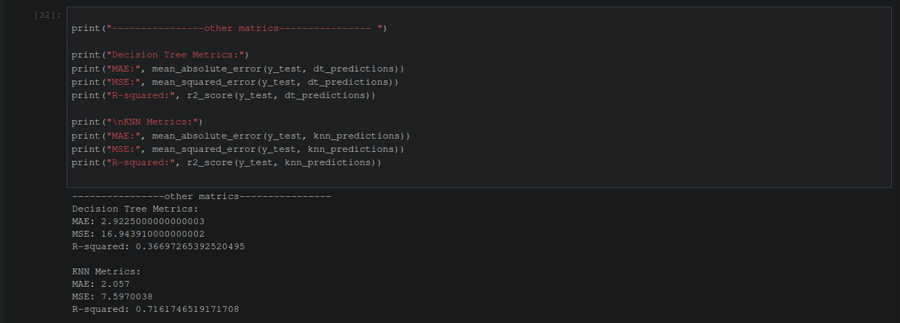

# machine-learning-assignment

project-structure
```
.
├── data
│   └── ... 
├── LICENSE
├── README.md
├── requirment.txt
├── script
│   ├── run.ipynb
│   └── run.py
└── src
    ├── data_describe.png
    ├── main_code.png
    ├── other_matrics.png
    └── output.png
```

DATA-SETS
```
.
└─ data                                  
  ├── physionet.org/files/shhpsgdb/1.0.0                     
  │   │   │           
  │   │   ├── 0000.arou         
  │   │   ├── 0000.comp         
  │   │   ├── 0000.dat          
  │   │   ├── 0000.edf          
  │   │   ├── 0000.hea          
  │   │   ├── 0000.hypn         
  │   │   ├── 0000.oart         
  │   │   ├── 0000.resp         
  │   │   ├── annotations.shtml 
  │   │   ├── ANNOTATORS        
  │   │   ├── index.html        
  │   │   ├── RECORDS           
  │   │   ├── reports.shtml     
  │   │   ├── SHA256SUMS.txt    
  │   │   └── wfdbcal           
  │   └── robots.txt                    
  └── testing-dataset                   
      └── vgsales.csv                   
```
total 9 directories, 26 files


## Instructions for Running the Project
note: If you are a windows user, run this on powershell
you can open it by hiting win+r & typeing "powershell" enter


#### 1. Clone the Repository
```
git clone https://github.com/Himanshu-Parangat/machine-learning-assignment
cd machine-learning-assignment/
```

#### 2. Create Virtual Environment & activate (optional)
```
python -m venv .env
.\.env\Scripts\activate
```

#### 3. install all packages
```
pip install -r requirements.txt
```

#### 4. run the project

> * for runing in terminal 
```
python3 ./script/run.py
```

> * for runing in notebook
```
jupyter notebook
```
> * open the ./script/run.ipynb file from your browser gui interface at url `http://localhost:8888/notebooks/run.ipynb`


#### Expected output

data describe

main 

output

additional


> note: 🚧 repo uses a testing data set, the new physionet dataset has yet to be used using wfdb library  🚧 

## Database fair uses 

### 1. testing-dataset

Video Game Sales, Analyze sales data from more than 16,500 games. this is a testing database for the project
> plese refer to url `https://www.kaggle.com/datasets/gregorut/videogamesales`
> I DO NOT HAVE THE OWNERSHIP FOR THIS DATA

Sources
* https://www.kaggle.com/datasets/gregorut/videogamesales
* https://github.com/GregorUT/vgchartzScrape
* https://www.vgchartz.com/gamedb/

### 2. physionet.org

Sleep Heart Health Study PSG Database (waveform)
> plese refer to url `https://physionet.org/content/shhpsgdb/1.0.0/` 
> I DO NOT HAVE THE OWNERSHIP FOR THIS DATA

**SHHS Polysomnography Database (Oct. 23, 2003, midnight)** 

The NHLBI-sponsored multi-center Sleep Heart Health Study has contributed the first of a planned set of 1000
overnight polysomnograms to PhysioBank. The study has investigated the relationship between sleep disordered
breathing and cardiovascular disease since 1995. The data include EEG, EOG, EMG, ECG, nasal airflow and
respiratory effort signals, SaO2 and heart rate measurements, and annotated sleep stages, respiratory events,
EEG arousals, and more.

**Citations**

This project uses the following resources:

```
APA 	    Goldberger, A., Amaral, L., Glass, L., Hausdorff, J., Ivanov, P. C., Mark, R., ... & Stanley,
            H. E. (2000). PhysioBank, PhysioToolkit, and PhysioNet: Components of a new research resource 
            for complex physiologic signals. Circulation [Online]. 101 (23), pp. e215–e220.

MLA 	    Goldberger, A., et al. "PhysioBank, PhysioToolkit, and PhysioNet: Components of a new research 
            resource for complex physiologic signals. Circulation [Online]. 101 (23), pp. e215–e220." (2000).

CHICAGO 	Goldberger, A., L. Amaral, L. Glass, J. Hausdorff, P. C. Ivanov, R. Mark, J. E. Mietus, G. B. Moody,
            C. K. Peng, and H. E. Stanley. "PhysioBank, PhysioToolkit, and PhysioNet: Components of a new 
            research resource for complex physiologic signals. Circulation [Online]. 101 (23), pp. 
            e215–e220." (2000).

HARVARD 	Goldberger, A., Amaral, L., Glass, L., Hausdorff, J., Ivanov, P.C., Mark, R., Mietus, J.E., Moody,
            G.B., Peng, C.K. and Stanley, H.E., 2000. PhysioBank, PhysioToolkit, and PhysioNet: Components of 
            a new research resource for complex physiologic signals. Circulation [Online]. 101 (23), pp. e215–e220.

VANCOUVER 	Goldberger A, Amaral L, Glass L, Hausdorff J, Ivanov PC, Mark R, Mietus JE, Moody GB, Peng CK, 
            Stanley HE. PhysioBank, PhysioToolkit, and PhysioNet: Components of a new research resource for
            complex physiologic signals. Circulation [Online]. 101 (23), pp. e215–e220.
```

Goldberger, A., Amaral, L., Glass, L., Hausdorff, J., Ivanov, P. C., Mark, R., ... & Stanley, H. E. (2000).
PhysioBank, PhysioToolkit, and PhysioNet: Components of a new research resource for complex physiologic signals. 
Circulation [Online]. 101 (23), pp. e215–e220.

